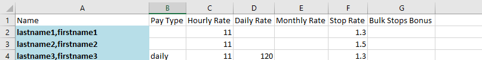
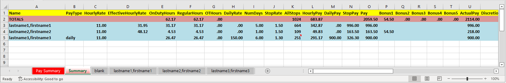
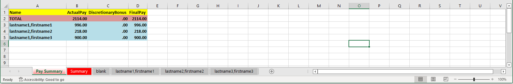
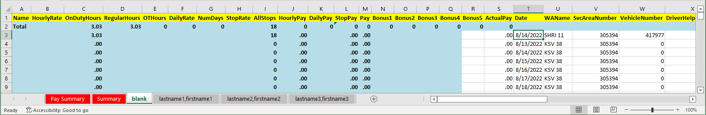
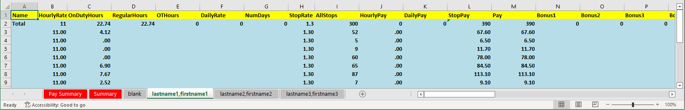

# Report Generation Tool

This tool generates report that helps to calculate the total stops and days by each person on all the routes for the week.

## Prereqs

This tool has been tested on a Windows 10 machine only.

## Installation

1. Download the executable file for your operating system from [Releases](https://github.com/wsw-reporter/reporter/releases) and unzip it in a folder.

   For windows download `reporter-win.zip`, for MacOS download `reporter-macos.zip` and for Linux download `reporter-linux.zip`

   If your computer's antivirus flags the executable, you will need to allow this program to be downloaded or turn off antivirus program.

2. Create a sub-folder named "employees". Note: This folder name is case sensitive.
3. The employees folder should have a `exmployee-list.xlsx`. This file provides details of how pay for each employee is calculated. Refer to [employee-list.xlsx section](#employee-listxlsx) for more details.

## Usage

1. Go to MyBizAccount and download the Weekly Worksheet data for the week ending on a Friday. I like to store it as `YYYYMMDD.xls`. Example: 20221130.xls
2. Open the xls in Excel and save it as `.xlsx` file. This tool can only process `.xlsx` files. 

   Note: Do not rename the file. You need to open it in excel and save the file as `.xlsx`

3. Go to command line. Run `reporter.exe "<pathToXlxsFile>"` from command line. Example: `reporter.exe "wsw\20221130.xlsx"`
4. The report will be stored in the same folder as the input file and will be named as `<file>-report.xlsx`. Refer to [~report.xlsx section](#reportxlsx) for more details.

## Important notes:

1. This tool comes with no warranty/guarantee at all. This user assumes all reponsibility. If you find any issues, please open an issue on this repo and I will try to look into it in my free time.
2. This tool considers the input where a helpers delivers some stops for the main driver
3. This tool will create a sheet named `blank` which will have all the entries from WSW which did not have an employee name. This generally occurs when only a helper logged into a route on that day, but no body logged in as a driver.
4. Always verify the output of the tool before using it for any purposes
5. This tool assumes a particular format of WSW. Any changes in the format of WSW will result in an error or wrong output of the tool.

## How to Compile

1. Clone this repository
2. Make sure nodejs is installed on your machine
3. Run the following to compile the project into a binary:
   
   ```bash
   npm install
   npm install -g pkg
   npm run build
   pkg -t win -o bin\reporter.exe .
   ```

----

## Understanding some files

### employee-list.xlsx



- Name: The name should match the name in WSW
- Pay Type: It should be `daily` or empty. Daily means that the total will be counted by multiplying "Daily Rate" with the number of days for the employee
- Hourly Rate: This is the rate that will be used to calculate the Hourly Pay for the employee. This will be ignored for "daily" Pay Type.
- Daily Rate: This is the rate that will be used to calculate the total Daily Pay for the employee.
- Monthly Rate: This is not used by the tool
- Stop Rate: This si the rate that will be used to calculate the total Stop Pay for the employee.

### -report.xlsx

#### Summary Sheet



- Name: The name will match the name in WSW
- PayType: The pay type detected from employee-list.xlsx file
- EffectiveHourlyRate: The hourly rate if a non-discretionary bonus is provided. Calculated from (ActualPay), (RegularHours), (OTHours).
- OnDutyHours: Total of all OnDutyHours for the name in WSW
- RegularHours: The number of hours if less than 40. If >40, the overflow will go in OTHours
- OTHours: The number of hours more than 40.
- DailyRate; The DailyRate for the name from employee-list.xlsx file
- NumDays: The total number of unique dates from WSW for the name
- StopRate: The StopRate for the name from employee-list.xlsx file
- AllStops: The total number of stops (delivery + pickup) from WSW for the name
- HourlyPay: (HourlyRate) x (Regular Hours) + (HourlyRate x 1.5) x (OTHours)
- DailyPay: (DailyRate) x (NumDays)
- StopPay: (StopRate) x (AllStops)
- Pay: Max(HourlyPay, DailyPay, StopPay)
- Bonus1-5: Non-discretionary bonus if promised to someone
- ActualPay: (Pay) + (Bonus1-5)
- Discretionary Bonus: Discretionary bonus 
- Final Pay: (ActualPay) + (DiscretionaryBonus)
- Rest of the columns: These are sum totals of the columns for the name in WSW

#### Pay Summary Sheet



This sheet contains the summary of the calculations from "Summary" sheet.

- Name: The name will match the name in WSW
- ActualPay: The ActualPay column entry for the name in "Summary" sheet.
- DiscretionaryBonus: The DiscretionaryBonus column entry for the name in "Summary" sheet
- FinalPay: The FinalPay column entry for the name in "Summary" sheet.

Note that making changes in the "Summary" sheet will reflect in this Pay Summary Sheet.


#### Blank Sheet



This sheet contains the entries from WSW (Excel format) that had no name. Thus the tool could not process these entries and need manual processing. This generally occurs when only a helper logged into a route on that day, but no body logged in as a driver.

Easiest way is to look up the WAName and the Date and find out the name from WSW online (note that excel format removes those names). Once the name is found, adjust the Summary sheet for that name with the stops/days/hours.

### Name Sheet



This sheet contains the data from WSW for a given name. This is generated to understand how the tool processed the WSW data. Note that making changes in this sheet does not affect any other sheets.